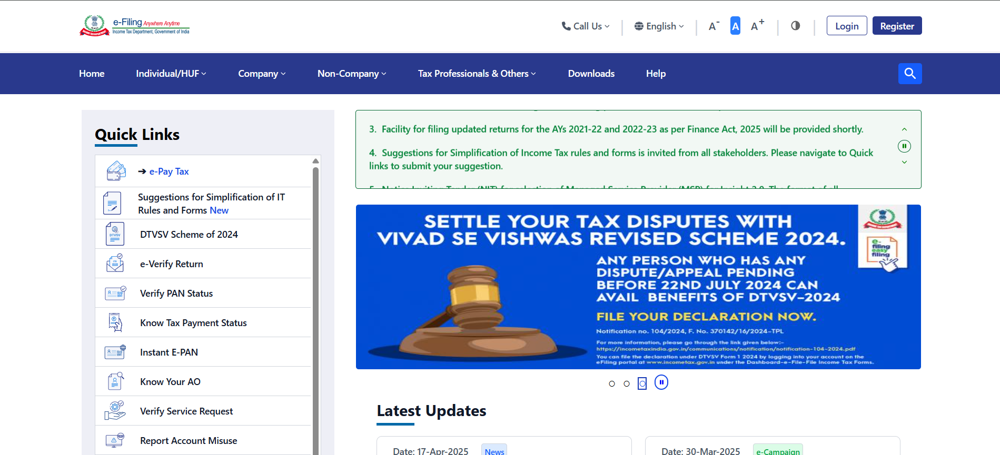

# 💼 Income Tax Management Portal

The **Income Tax Management Portal** is a responsive, user-friendly web application built using **React** and **Vite**, tailored for individuals, companies, and tax professionals to access tax-related services seamlessly. With a modern UI powered by **Tailwind CSS** and deployed on **Vercel**, the portal ensures a fast, intuitive, and accessible experience across all devices.

---

## 🚀 Features

- **Responsive Navigation**: Tap-based toggle menu on mobile (`<640px`) with scroll-based header visibility.
- **Quick Links Sidebar**: Mobile-optimized sidebar for tools like _e-Pay Tax_, _e-Verify Return_, etc., with scroll toggling.
- **Success Enablers Section**: Showcases features/testimonials with full-width mobile-friendly layouts.
- **Comprehensive Footer**: Includes About Us, Contact Us, Related Sites, and social media links—fully responsive.
- **Scroll to Top**: Button appears after scrolling 300px for quick navigation.
- **Interactive UI**: Styled with **Tailwind CSS** and **React Icons/FontAwesome** for clarity and engagement.

---

## 🛠 Technologies Used

- **Frontend**: React.js + Vite
- **Styling**: Tailwind CSS
- **Icons**: React Icons, FontAwesome
- **Deployment**: Vercel

---

## 🌍 Live Demo

👉 [View Live Project](https://income-tax-filing.vercel.app/)

---

## 📸 Dashboard Screenshot

- !

---

## 📦 Installation

Follow these steps to run the project locally:

```bash
# 1. Clone the repository
git clone https://github.com/your-username/income-tax-portal.git

# 2. Navigate to the project directory
cd income-tax-portal

# 3. Install dependencies
npm install

# 4. Start the development server
npm run dev
```

---

## 📁 Project Structure

incomeTax_filing/
├── src/
│ ├── assets/
│ ├── components/
│ ├── App.jsx
│ ├── main.jsx
│ ├── index.css
├── public/
├── Home.png
├── index.html
├── package.json
├── vite.config.js
├── tailwind.config.js
├── README.md

---

## 🎯 Usage

- Navigate sections using the Navbar (Home, Individual/HUF, Company).
- Use the hamburger menu and Quick Links sidebar on mobile for essential tools.
- Explore the Success Enablers section to learn about key features.
- Access About Us, Contact Us, and social media in the Footer.
- Use the Scroll to Top button for easy navigation after scrolling.

## 🤝 Contributing

We welcome contributions!

1. Fork the repository.
2. Create a new branch (git checkout -b feature/YourFeature).
3. Commit your changes.
4. Push to your fork and create a pull request.

Your contributions make this portal better for everyone!

---

Happy coding! 🚀
